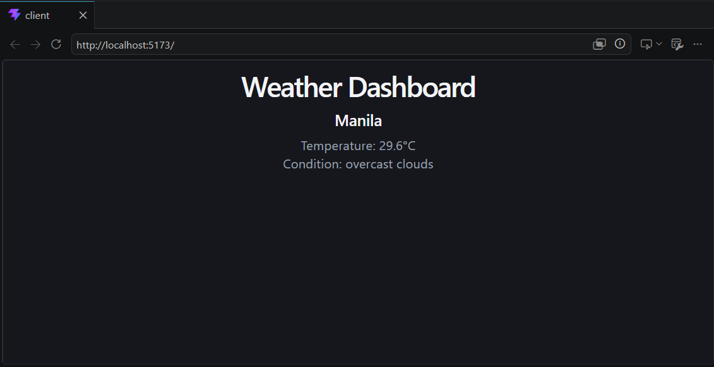

# Weather Dashboard (MERN Stack)

A full-stack weather application that securely bridges a React frontend with the OpenWeatherMap API using an Express.js backend.

## Features
- **Secure Backend Proxy:** API keys are handled server-side to prevent exposure.
- **Modern Frontend:** Built with React and Vite for fast performance.
- **Efficient Workflow:** Uses `concurrently` to run both client and server with one command.

## How to Run
1. Clone the repository.
2. Create a `.env` file in the `/server` folder and add `WEATHER_API_KEY=your_key_here`.
3. Install dependencies: `npm install`.
4. Run the application: `npm run dev`.